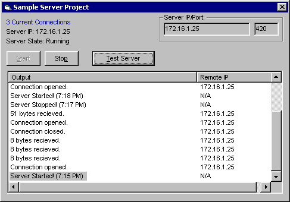



## A multiple connection server control \*UPDATED\*

### Description

This ActiveX control makes it extremely easy to create server applications. It uses an array of Winsock controls to handle multiple connections. Start the server with one line of code! I included a sample project and a detailed explanation of all the events, properties, and methods, so you can see exactly how it is used (readme.rtf). Since PSC removes the OCX file from my zip, you can get it here: http://www.bouncefilterware.com/drew/ServerControl.ocx -- Your comments/questions/suggestions are welcome.

UPDATE: I added a broadcast function. Although it's not the proper way to broadcast data, it works.
 
### More Info
 

             |
---                |---
**Submitted On**   |2002-02-03 17:49:04
**By**             |[Drew Lederman](https://github.com/Planet-Source-Code/PSCIndex/blob/master/ByAuthor/drew-lederman.md)
**Level**          |Intermediate
**User Rating**    |4.9 (269 globes from 55 users)
**Compatibility**  |VB 6\.0
**Category**       |[Custom Controls/ Forms/  Menus](https://github.com/Planet-Source-Code/PSCIndex/blob/master/ByCategory/custom-controls-forms-menus__1-4.md)
**World**          |[Visual Basic](https://github.com/Planet-Source-Code/PSCIndex/blob/master/ByWorld/visual-basic.md)
**Archive File**   |[A\_multiple52668232002\.zip](https://github.com/Planet-Source-Code/drew-lederman-a-multiple-connection-server-control-updated__1-12569/archive/master.zip)

